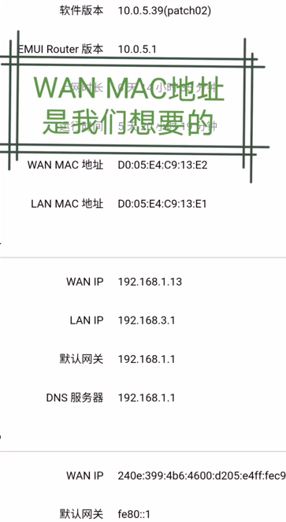
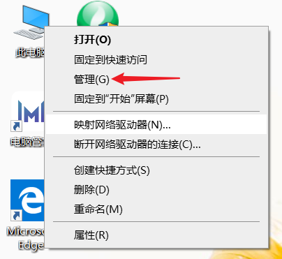
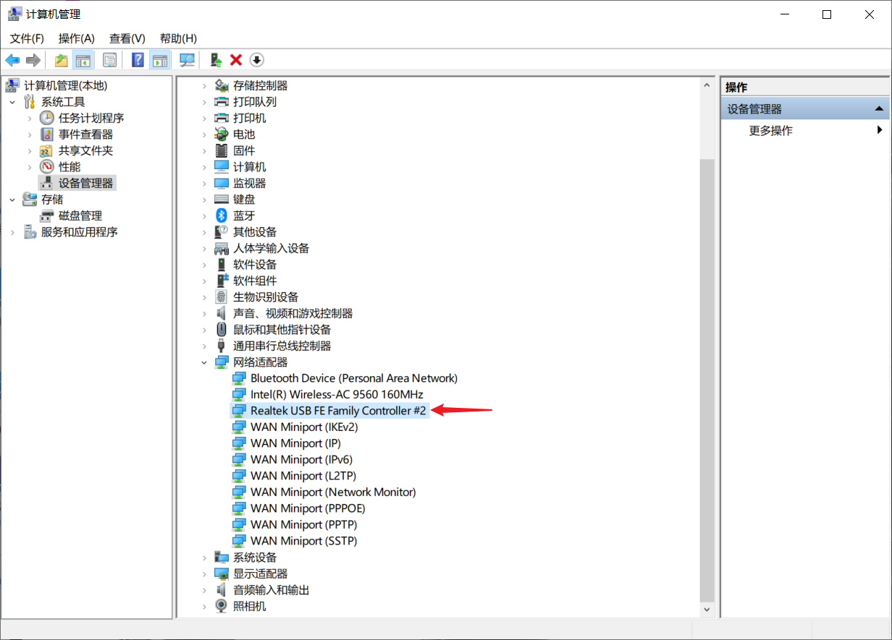
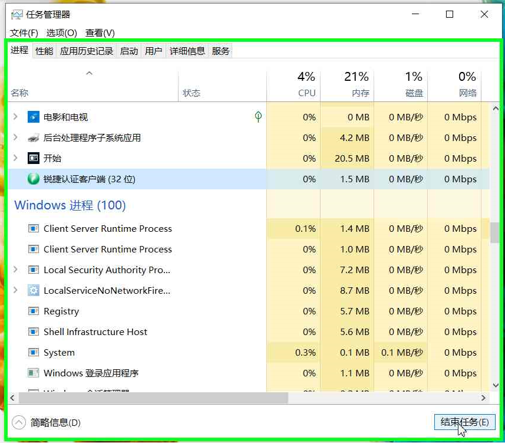
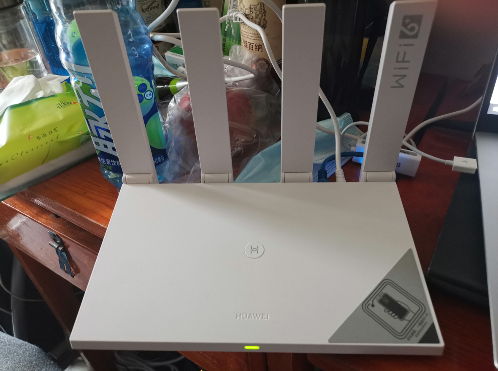

# 四川大学望江校区校园网使用普通路由器的方法

> 因为时间关系，中午就在以前同学的寝室做了40分钟实验，验证了想法的可行性，写了这篇文档。文档中有一些不完善的地方，**我会在将来的版本中修改**。
>
> github地址：https://github.com/lxg-scu/scunet
>
> gitee地址：https://gitee.com/lxg-scu/scunet
>
> 如果你在使用过程中遇到了问题或者有更好的想法，欢迎在github或gitee上跟我讨论，或者发邮件告诉我，我的邮箱是lxg@stu.scu.edu.cn。
>
> 此外：如果本文档侵犯了任何公司或组织的合法权益，也请联系我删除，谢谢。
>
> by：机智的铅笔
>
> 2020.9.5

> **注意：**本方法第一次操作可能会稍显繁琐，熟悉之后每次配置也就1分钟，可能都不到。**本方法断电断网十分钟以上路由器就无法再联网，需要重新配置，因此比较适合寝室不断电断网的研究生和博士宿舍**，本科宿舍每天断电，如果不怕麻烦，也可以使用。

> **主要思路**：校园网实际上是通过网卡的MAC地址分辨不同的设备，如果把一台电脑的网线拔掉再插入电脑上，网络可以恢复，但是插到另一台电脑上，第二台电脑还是无法上网，原因就是两台网卡的MAC地址不同。**因此可以把电脑网卡的MAC地址设置与路由器的MAC地址相同，电脑连上校园网之后，再把网线插上路由器，路由器就可以成功上网**

## 一、 查看路由器的MAC地址

​		我使用的是华为（荣耀）路由器，其它路由器查看方法也大同小异。**路由器底部会印有MAC地址，但是这个是路由器LAN的MAC地址，不是我们需要的**。（如果担心选择其他路由器操作不顺利，可以选择荣耀路由器3，在寝室完全够用，并且价格比较低，而且与我的操作完全相同，文档中使用的华为路由AX3 Pro实在太贵了）

​		登录进入路由器的管理后台。将路由器插上电，没有配置过的路由器会生成一个无密码的WIFI信号，用设备连接这个WiFi信号，在浏览器地址栏里面输入192.168.3.1（其他路由器的管理地址多为192.168.0.1，如果都不是建议网上查找一下）。路由器上网模式选择DHCP上网，配置WiFi的名称和密码以及路由器的管理员密码，重启路由器之后连接。*此时的路由器并没有插网线上网，这一步只是配置了网络文件和为接下来查看路由器的MAC地址做准备。*

​		设备重新连接上路由器的WiFi之后，重新在路由器地址栏输入192.168.3.1，输入管理员密码登录到路由器的后台（**如果使用的是手机或者平板浏览器，在右上角选择电脑模式，因为手机浏览器显示的信息非常少**），在最后一个标签中查看到MAC地址(标签名字我忘了，下一版的PDF我会写的更详细一些)，如下图所示。

##二、 设置电脑网卡的MAC地址

> **这里建议使用一个USB转网口的转接线，这样配置完了以后，把转接口拔掉，对自己的电脑没有什么影响。**

1. 右击我的电脑，点击管理

   

2. 在设备管理器中选择网络适配器，再找到自己的USB网卡。（如果无法判断自己的网卡是哪一个，可以拔掉重新插，会显示不同）

   

   > 我这里使用的是在京东上购买的山泽USB转网口，不是经过比较觉得它是最优解，而是看它便宜，恰好也能使用。
   
3. **右击**自己的网卡，选择**属性**， 再选择**高级**，在高级的属性中选择**Network Address**，在**值**中填写自己的**路由器MAC地址**，点击**确定**，退出。（此后这个网卡插入这个电脑MAC地址都将是自己设置的值，但是插入别的电脑MAC地址仍然是出厂值，不是自己设置的值）

   

## 三、 使用锐捷客户端进行认证上网

​		这部分比较简单，到学校的[信息管理中心](http://imc.scu.edu.cn/gnyx/khdxgxz.htm)下载锐捷客户端安装（推荐使用6.82版本），然后填写自己的帐号登录。**接下来的操作不做也许也可以，我测试之后下一版文件中给出操作最方便的方法。**

​		右键桌面最下面的**任务栏**，选择**任务管理器**，在任务管理器中查找到**锐捷的进程**，**右键选择结束任务**。

## **四、 配置路由器**

​	将电脑的网线拔掉，插入路由器的WAN端口上，路由器等待十几秒之后，就会显示已连接到网络的信号灯。

